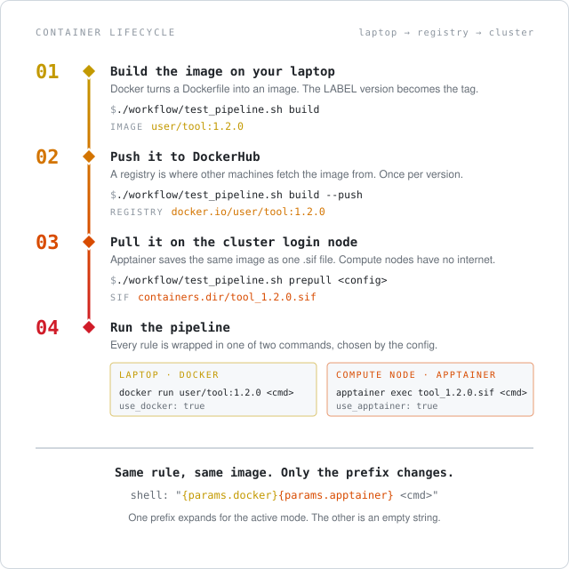

# {{ cookiecutter.project_name }} - pipeline guide

How to set up, run, and extend this Snakemake pipeline, generated from
[snakemake-hpc-template](https://github.com/gladstone-institutes/snakemake-hpc-template).
Defaults target **UCSF CoreHPC (Slurm, with GPU)**, the supported and validated cluster path.
Other Slurm sites change one path (`project_root`) and the Slurm account.

> Turning existing scripts into rules, or pointing a coding agent at this repo?
> Start with [`../AGENTS.md`](../AGENTS.md).

## Containers in one minute

New to containers? Five facts cover this pipeline.

- A **container image** is a frozen software environment: an OS, your tool, its libraries.
  It is described by a `Dockerfile` and identified by `user/name:tag`.
- **Docker** builds images and runs them on your laptop.
- HPC clusters do not allow Docker (it needs root). They use **Apptainer**, which runs the
  same image after converting it to a single `.sif` file. Apptainer can build images of
  its own, but this pipeline builds only with Docker (why: below).
- Images travel through a **registry** (DockerHub): you push from your laptop, the cluster
  pulls. CoreHPC compute nodes have no internet, so the pull happens on a login node first.
- Each rule's command is wrapped in `docker run ...` or `apptainer exec ...` depending on
  `execution.use_docker` / `execution.use_apptainer` in the config. The rule itself never
  changes.

<p align="center">
  
</p>

## Prerequisites

- [uv](https://docs.astral.sh/uv/) for the Python environment
- **Docker** for local runs and for building images (the only build path), **or**
  **Apptainer** for cluster runs
- A DockerHub account, only if you build your own images

## Quickstart

```bash
uv sync
uv run ./workflow/pipeline.sh dry-run        # check the job graph (the DAG)
uv run ./workflow/pipeline.sh run            # run locally in Docker
uv run ./workflow/pipeline.sh run-apptainer  # run on the login node with Apptainer
```

The shipped `hello` rule writes one greeting per sample to
`.tests/integration/results/<sample>/hello.txt`. It uses the public `library/bash:5` image,
so no DockerHub account is needed.

For real data, edit `workflow/config/config.yaml` and list samples in
`workflow/config/samples.tsv` (columns `sample_id`, `description`, plus whatever your rules need).

## Running on UCSF CoreHPC (Slurm)

### Check the setup first

Run the shipped `hello` example on the cluster before wiring in your own scripts. It
exercises every moving part (Apptainer, image download, Slurm submission, the driver job,
the status file) with nothing of yours in the way, so a failure later can only be your
rule. Finish each step before starting the next.

```bash
ssh <you>@plog1.cmf.ucsf.edu      # a CoreHPC login node
cd <your clone>
uv sync

# 1. The job graph resolves with the cluster profile.
uv run ./workflow/pipeline.sh dry-run-slurm

# 2. Two hello jobs run through Slurm. Short, so the login shell is fine here.
#    Non-Gladstone: append --config project_root=/your/storage
uv run ./workflow/pipeline.sh run-slurm

# 3. The same example through the driver job, with your cluster config.
cp workflow/config/config_corehpc.yaml.example workflow/config/config_corehpc.yaml  # edit project_root
./workflow/launch.sh all check    # dry-run, submit nothing
./workflow/launch.sh all          # download images, then submit the driver
squeue --me                       # the driver, then one job per sample
```

What each step should leave behind:

- Step 2: `<project_root>/.tests/integration/results/<sample>/hello.txt` for `sampleA` and
  `sampleB`, and `bash_5.sif` in `<project_root>/containers/`.
- Step 3: `<project_root>/results/<sample>/hello.txt` for every row of
  `workflow/config/samples.tsv`, `<project_root>/results/logs/status/latest.txt` reading
  `SUCCESS`, the driver's log under `<project_root>/results/logs/driver/`, and an email if
  your site has Slurm mail set up.

If a step fails, fix it here. The pitfalls list in
[`../workflow/profiles/slurm/README.md`](../workflow/profiles/slurm/README.md) covers the
usual causes. Only then replace `hello` with your rules, following [`../AGENTS.md`](../AGENTS.md).

### How launch.sh runs the pipeline

Real runs go through `launch.sh`, which handles three CoreHPC constraints:

- **Login shells are ended** when your SSH session drops, tmux included. So snakemake runs
  as its own Slurm job and submits the step jobs from a compute node. That job is the driver.
- **Compute nodes have no internet.** Images are downloaded ahead of time on the login node, and the
  CoreHPC config sets `containers.auto_pull: false`.
- **`$HOME` has a small quota.** The uv and Apptainer caches go to `<project_root>/.cache`.

A scope is a named way of running the pipeline: which rules, which images, how long. Add one
to the `scope_setup` table in `launch.sh` per way you run it. Stop a driver with
`scancel --signal=TERM <jobid>`. Account and partition defaults, resource mapping, and
every cluster pitfall are in
[`../workflow/profiles/slurm/README.md`](../workflow/profiles/slurm/README.md).

### GPU rules

Pass `gpu=True` to both `apptainer_run()` and `_resources()`:

```python
rule train:
    output: "{output_dir}/{sample}/model.pt"
    params:
        docker=docker_run("mytool"),
        apptainer=apptainer_run("mytool", gpu=True),
        # optional: log nvidia-smi utilization to gpu_usage_train_<jobid>.csv
        gpu_sampler=lambda w, output: gpu_sampler_prefix(
            Path(output[0]).parent, "train", gpu=True),
    threads: _threads("train")
    resources:
        **_resources("train", gpu=True),
    shell:
        "{params.gpu_sampler}{params.docker}{params.apptainer} mytool train ..."
```

On Slurm this routes the job to the GPU partition with `--gres` and adds `--nv` to
Apptainer. Partition and gres come from the `gpu:` block in `config.yaml` (defaults
`small_gpu` / `gpu:nvidia_l40s:1`). Concurrent GPU jobs are capped at 1, CoreHPC's per-user
limit; raise it with `--resources max_concurrent_gpu_jobs=N`.

## Building your own container

Images are built ahead of time, never during a run.

### Why Docker builds, and where images live

- One Dockerfile serves both runtimes. A Docker image runs under Docker on a laptop and
  under Apptainer on the cluster, which converts it on pull. A `.sif` built from an
  Apptainer definition file runs only under Apptainer, so you would maintain two builds.
- Building needs root-like privileges and internet. A laptop has both; CoreHPC compute
  nodes have neither.
- The registry is where laptop and cluster meet: push once, pull anywhere. Docker also
  caches build steps, so a rebuild after a small Dockerfile change is fast.
- **Private images.** Docker Hub's free Personal plan allows one private repository, with
  unlimited public ones. Pull limits depend on the plan, see
  [Docker Hub usage and limits](https://docs.docker.com/docker-hub/usage/). For more private
  images use a paid Docker plan or another registry such as GitHub Container Registry. Any
  registry works with this template: set `user: "ghcr.io/<org>"` in the config and
  `IMAGE=ghcr.io/<org>/<name>` in `build.sh`. Both simply prepend `user` to the image name.
- Pulling a private image on the cluster needs a login on the **login node** before
  `prepull`: `apptainer registry login --username <you> docker://<registry>`. Compute nodes
  cannot reach the registry at all.

1. **Edit** `workflow/containers/<name>/Dockerfile`. Its `LABEL version="X.Y.Z"` is the
   single source of truth for the tag; `build.sh` reads it.
2. **Build** (plain `docker build` underneath, so `uv run` is optional):
   ```bash
   ./workflow/pipeline.sh build <name>            # one image
   ./workflow/pipeline.sh build                   # every image under workflow/containers/
   ./workflow/pipeline.sh build <name> --no-cache # force rebuild
   ```
3. **Push** to DockerHub. Required before any cluster run, since Apptainer pulls from there:
   ```bash
   ./workflow/pipeline.sh build <name> --push
   ```
4. **Point the config at it.** In `workflow/config/test_config.yaml`, replace the
   `library/bash` quickstart values under `containers.images.hello` with
   `user: "{{ cookiecutter.docker_username }}"`, `name: "hello"`, `tag: "<version>"`.
   Bump `tag:` in `workflow/config/config.yaml` every time you bump `LABEL version`.
   A mismatch silently runs the old image.

## Adding a new rule

Full conventions and the questions to answer first are in [`../AGENTS.md`](../AGENTS.md).
The short version:

1. Create `workflow/rules/<name>.smk` by copying the shape of
   [`../workflow/rules/hello.smk`](../workflow/rules/hello.smk): both container params, the
   script as an `input:`, `_threads` / `_resources`, a `benchmark:` and a `log:`.
2. Add a `<name>:` entry under `resources:` in `workflow/config/config.yaml`
   (`threads`, `mem_gb`, `runtime_min`, optional `scratch_gb`).
3. Add `include: "rules/<name>.smk"` to `workflow/Snakefile` and extend `rule all`.
4. For on-cluster overrides only, use the commented `set-resources:` block in the profile.

## Adding a new container

1. `mkdir workflow/containers/<name>` and add a `Dockerfile` with a `LABEL version="..."`.
   End it with a verification `RUN` that loads every package the rules need, so a failed
   install fails the build rather than a cluster job.
2. Copy `workflow/containers/hello/build.sh` into the new dir and set
   `IMAGE={{ cookiecutter.docker_username }}/<name>`.
3. Register it under `containers.images.<name>` in `config.yaml` and `test_config.yaml`,
   with `tag:` matching the `LABEL version`.
4. `./workflow/pipeline.sh build <name>`, then `--push`. Confirm the tag landed:
   `docker manifest inspect {{ cookiecutter.docker_username }}/<name>:<tag>`.
5. Before a cluster run: `uv run ./workflow/pipeline.sh prepull <config>` on a login node.

## How it is wired

Two helpers in `workflow/rules/common.smk` make one Snakefile run in every mode. Snakemake's
`container:` directive is deliberately **not** used.

- `docker_run("img")` returns a `docker run ...` prefix in Docker mode, else `""`. It runs
  as your user with `HOME=/workspace` by default (`execution.docker_run_as_user`), so
  outputs are yours and `$HOME` matches Apptainer.
- `apptainer_run("img", gpu=...)` returns an `apptainer exec ...` prefix in Apptainer mode,
  else `""`. With both empty the command runs on the host.
- `project_root` in a cluster config is the one storage path. A relative `output_dir` or
  `containers.dir` resolves under it, and it is bound into both runtimes. One function in
  `workflow/scripts/config_paths.py` does this for the rules, `resolve_sifs.py`, and `launch.sh`.

Resources are config-driven: each rule's `threads`, `mem_gb`, `runtime_min` live under
`resources:` in `config.yaml`, and `_resources()` translates them to Slurm (or SGE) keys for
the active profile. Initial values are guesses. After a run, replace them with measurements:

```bash
uv run python workflow/scripts/calibrate_resources.py --output_dir results
```

Two more per-rule conventions (why they matter is in `hello.smk` and `AGENTS.md`): the
script is declared as an `input:` so edits rerun the rule, and every rule writes a persistent
`log:` under `{output_dir}/logs/<rule>/` because scheduler logs are deleted on success.

## Running on Wynton SGE (deprecated)

> **Deprecated and unmaintained.** This path still works for pipelines already on Wynton,
> but fixes and features go to CoreHPC Slurm. `dry-run-sge` / `run-sge` print a warning.

```bash
ssh log1.wynton.ucsf.edu
cd <your clone>
uv sync
./workflow/pipeline.sh build --push          # optional: push custom images first
uv run ./workflow/pipeline.sh dry-run-sge
uv run ./workflow/pipeline.sh run-sge
```

Wynton defaults are baked in: `/opt/sge/wynton/common/accounting` for `qacct` status checks
(override with `SGE_ACCOUNTING`), `--bind /scratch`, and per-slot `mem_free` handling in
`workflow/profiles/sge/config.yaml`. Non-Gladstone users edit the bind paths in
`workflow/config/config_wynton.yaml.example`.

## Project layout

```
workflow/
├── Snakefile                 # workflow entry point; onstart/onsuccess/onerror hooks
├── rules/
│   ├── common.smk            # sample loader, docker_run/apptainer_run, _resources, notifications
│   ├── containers.smk        # pull_container rule: download SIFs on a login node
│   └── hello.smk             # example rule (copy its shape for new rules)
├── config/
│   ├── config.yaml                    # main config (resources: + gpu: blocks)
│   ├── test_config.yaml               # local Docker
│   ├── test_config_apptainer.yaml     # add-on for local/SGE Apptainer
│   ├── test_config_apptainer_slurm.yaml  # add-on for CoreHPC Slurm
│   ├── config_corehpc.yaml.example    # CoreHPC Slurm cluster config
│   └── config_wynton.yaml.example     # Wynton SGE cluster config (DEPRECATED)
├── profiles/
│   ├── local/                # Docker executor
│   ├── apptainer-dev/        # Apptainer on a dev node
│   ├── slurm/                # CoreHPC Slurm (supported; GPU validated)
│   └── sge/                  # Wynton SGE (DEPRECATED, unmaintained)
├── containers/
│   └── hello/                # Dockerfile + build.sh
├── scripts/
│   ├── hello.sh              # example script, declared as the hello rule's input
│   ├── calibrate_resources.py  # suggest resources: values from benchmark TSVs
│   └── resolve_sifs.py       # config -> .sif paths (used by prepull)
├── launch.sh                 # submit a cluster run as a Slurm driver job
└── pipeline.sh               # command-line helper: run, build, prepull, ...
```

## Troubleshooting

- **Did the run finish?** Every run writes `{output_dir}/logs/status/latest.txt`
  (`SUCCESS` / `FAILED` + timestamp). It needs no mail, network, or scheduler.
- **No email arrived.** `send_notification()` needs `mail` or `sendmail`, which CoreHPC nodes
  lack. `launch.sh` has the Slurm controller send it instead (`--mail-type=END,FAIL`).
  Details in [`../workflow/profiles/slurm/README.md`](../workflow/profiles/slurm/README.md).
- **First Apptainer run is slow.** `onstart` pulls missing `.sif` files into `containers.dir`.
  Set `containers.auto_pull: false` if you manage SIFs yourself.
- **A Slurm job sits in `PD` forever.** Read the reason in `squeue`. `(PartitionTimeLimit)`
  means `runtime_min` exceeds the partition MaxTime; `(Resources)` can mean no node has that
  much memory. Neither fails on its own. Cap `runtime_min` and `max_node_mem_gb`.
- **`Failed to initialize cache ... Disk quota exceeded`.** The uv or Apptainer cache is in
  `$HOME`. Point `UV_CACHE_DIR` / `APPTAINER_CACHEDIR` at project storage. `launch.sh`
  puts them in `<project_root>/.cache`.
- **A cheap rule wants to rebuild the whole pipeline.** An intermediate is missing, or a
  killed job left a `Forced execution` flag. `--rerun-triggers mtime` prevents neither.
  Dry-run and read the job table first; read-only scopes in `launch.sh` do this automatically.
- **An edited script did not rerun its rule.** The rule is missing
  `script=script_path(...)` in its `input:`.
- **Stale lock after a killed driver.**
  `uv run snakemake --snakefile workflow/Snakefile --configfile <cfg> --unlock`.
  Prefer `scancel --signal=TERM` so it exits cleanly.
- **SGE jobs show "success" but outputs are missing** (deprecated path).
  `workflow/profiles/sge/status.sh` consults `qacct` to catch this; confirm
  `SGE_ACCOUNTING` is readable from the submission host.
